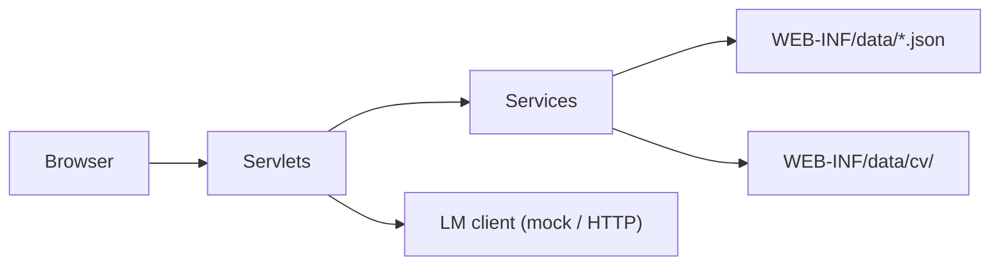

# TA Recruitment System

**EBU6304 Software Engineering · Group 51**  
Web platform for Teaching Assistant recruitment at BUPT International School.

| | |
|---|---|
| **Version** | 1.0.0 |
| **License** | [MIT](LICENSE) |
| **Context path** | `/ta-recruitment` |
| **Storage** | JSON files — no database |

---

## At a glance

| Role | What they do | Landing page |
|------|----------------|----------------|
| **TA applicant** | Register, profile + CV, browse jobs, apply, track status | `/job` |
| **Module organiser (MO)** | Publish vacancies, review applicants, approve/reject | `/mo` |
| **Administrator** | Users, jobs, workload, CSV export, analytics | `/admin` |

**Try it in 30 seconds** (local Maven):

```powershell
mvn clean package
mvn tomcat7:run-war
```

Open **http://localhost:18080/ta-recruitment/login** · Demo: `admin@bupt.local` / `admin123`

Run tests: `mvn test`

---

## Quick start

### Prerequisites

| Tool | Version |
|------|---------|
| JDK | 11+ |
| Maven | 3.9+ |
| Tomcat | 9.x *(or use Maven plugin / Docker below)* |

```powershell
winget install Apache.Maven   # Windows
mvn -version
```

### Option A — Docker *(recommended for demo + email)*

```powershell
mvn clean package
docker compose up --build
```

| Service | URL |
|---------|-----|
| Application | http://localhost:8080/ta-recruitment/login |
| MailHog (SMTP UI) | http://localhost:8025 |

No database. Seed JSON ships inside the WAR; CV uploads go to `WEB-INF/data/cv/`.

→ Full env vars, backup, HTTPS: [docs/DEPLOYMENT.md](docs/DEPLOYMENT.md)

### Option B — Local Maven + embedded Tomcat

```powershell
mvn clean package
mvn tomcat7:run-war
```

→ http://localhost:18080/ta-recruitment/login · Stop with `Ctrl+C`

**Password-reset email (optional):** MailHog is **not** started by Maven. Either use Docker (Option A) or run MailHog separately:

```powershell
docker compose up mailhog -d
$env:SMTP_HOST = "localhost"
$env:SMTP_PORT = "1025"
mvn tomcat7:run-war
```

SMTP UI: http://localhost:8025

### Option C — External Tomcat 9

```powershell
mvn clean package
# Copy target/ta-recruitment.war → {TOMCAT}/webapps/
```

Runtime data is written under the exploded WAR at `WEB-INF/data/`.

---

## Demo accounts

Seed passwords are plaintext for coursework (`admin123`, `mo123`, `ta123`). New registrations use BCrypt. **Change before any public deployment.**

| Role | Email | Password |
|------|-------|----------|
| Administrator | `admin@bupt.local` | `admin123` |
| Module Organiser | `mo@bupt.local` | `mo123` |
| TA Applicant | `alice.chen@bupt.local` | `ta123` |
| TA Applicant | `brian.li@bupt.local` | `ta123` |
| TA Applicant | `clara.wang@bupt.local` | `ta123` |
| TA Applicant | `daniel.zhang@bupt.local` | `ta123` |

The login page has a collapsible demo-account panel.

| Walkthrough | Link |
|-------------|------|
| Step-by-step user guide | [docs/USER_MANUAL.md](docs/USER_MANUAL.md) |

---

## Features

### TA applicant flow

1. Register or log in → 2. Complete profile & upload CV → 3. Browse/filter jobs on `/job` → 4. Apply from job detail → 5. Track status on `/applications`

AI hints (mock by default) on job pages: recommendations, skill match, missing skills.

### Module organiser flow

1. Log in → 2. Open `/mo` dashboard → 3. Create/publish vacancy → 4. Review profile & CV → 5. Accept or reject with feedback

MO users only see applications for **their own** job postings.

### Administrator flow

1. Log in → 2. Open `/admin` dashboard (KPIs, charts, AI briefing) → 3. Manage users & jobs → 4. Monitor TA workload → 5. Export CSV or override application status

---

## Tech stack

| Layer | Choice |
|-------|--------|
| Language | Java 11 |
| Web | Servlet 4.0, JSP 2.3, JSTL |
| Server | Apache Tomcat 9.x |
| Persistence | JSON files under `WEB-INF/data/` + CV on disk |
| Security | BCrypt, CSRF on POST, role-based access |
| Email | JavaMail → optional SMTP (MailHog in Docker) |
| AI | Pluggable LM layer — **mock** default, HTTP OpenAI-compatible scaffold |
| Build / test | Maven 3.9+, JUnit 5, Mockito |
| CI | GitHub Actions — `mvn clean verify` |



---

## Main routes

Base URL: `{host}/ta-recruitment`

| Path | Access | Purpose |
|------|--------|---------|
| `/login`, `/register`, `/logout` | Public | Authentication |
| `/forgot-password`, `/reset-password` | Public | Password reset *(email if SMTP set)* |
| `/profile`, `/cv` | TA | Profile & CV |
| `/job` | TA | Job list, detail, favorites, AI hints |
| `/applications` | TA | Apply, withdraw, filter by status |
| `/mo` | MO | Dashboard, jobs, approve/reject |
| `/mo/applicant-profile` | MO | Read-only applicant view |
| `/admin` | Admin | Dashboard, analytics, user/job management |
| `/admin/export` | Admin | CSV export |
| `/admin/ai-demo` | Admin | AI feature playground |
| `/api/ai/stream` | TA / MO / Admin | SSE streaming AI responses |

All state-changing **POST** requests require a CSRF token.

---

## AI features

Default provider is **mock** (offline, deterministic). Set `LM_PROVIDER=openai` with `LM_BASE_URL` and `LM_API_KEY` for a real model. AI output is **advisory** — humans make hiring decisions.

| Feature | Audience | Where |
|---------|----------|-------|
| Job recommendation | TA | `/job` → `?feature=recommendation` |
| Skill match | TA | `?feature=skillMatch` |
| Missing skills | TA | `?feature=missingSkills` |
| Workload advice | MO | `?feature=moWorkloadAdvice` |
| Processed decision review | MO | `?feature=moDecisionReview` |
| Platform analytics briefing | Admin | `/admin` → `?feature=adminAnalytics` |
| Feature demo | Admin | `/admin/ai-demo` |

Config: copy `WEB-INF/lm.properties.example` → `lm.properties`, or use `LM_*` env vars. See [docs/DEPLOYMENT.md](docs/DEPLOYMENT.md).

---

## Repository layout

```text
Recruitment-System-for-TA/
├── docs/                         # SE docs, backlog xlsx, user manual
├── src/main/java/com/bupt/ta/
│   ├── ai/                       # LM client, MockLmClient, HttpLmClient
│   ├── model/                    # User, Job, Application, …
│   ├── persistence/              # AppInitListener, ServiceFactory
│   ├── security/                 # PasswordHasher, CsrfFilter
│   ├── service/                  # Business logic + JSON I/O
│   └── servlet/                  # HTTP controllers
├── src/main/webapp/WEB-INF/data/ # users.json, jobs.json, applications.json, …
├── src/test/java/                # Unit & integration tests
├── docker-compose.yml
├── Dockerfile
└── pom.xml
```

| File / folder | Contents |
|---------------|----------|
| `users.json` | Accounts (`role`: TA / MO / ADMIN) |
| `profiles.json` | Applicant profiles + education JSON |
| `applications.json` | Submissions, status, MO feedback |
| `jobs.json` | Published vacancies |
| `cv/{userId}/` | Uploaded CV files *(runtime)* |

---

## Documentation

### For users

| Document | Description |
|----------|-------------|
| [docs/USER_MANUAL.md](docs/USER_MANUAL.md) | TA, MO, Admin workflows |


### For demos

**Backlog:** [docs/ProductBacklog_group51.xlsx](docs/ProductBacklog_group51.xlsx)  
**Coursework PDFs** (`Prototype_group51.pdf`, `Report_group51.pdf`) are submitted separately, not in this repo.

---

## Developer notes

```powershell
mvn test                              # Run all tests
mvn javadoc:javadoc                   # API docs → target/reports/apidocs/
```

Test utilities: `FileTestSupport`, `ServletTestSupport`, `TestFixtures`.  
Unset global `LM_*` env vars for deterministic local test runs.

---

## Team

| GitHub | Branch | QMUL ID | Name |
|--------|--------|---------|------|
| Markrivera683 | Ruiyang_Sun | 231226783 | Sun Ruiyang (孙瑞阳) |
| christine288 | Qixin_Li | 231225373 | Li Qixin (李其馨) |
| Hzwnt | Tianjing_Zhuang | 231225351 | Zhuang Tianjing (庄天婧) |
| S01ZZ | Qinchun_Chen | 231225410 | Chen Qinchun (陈沁纯) |
| g726unknown | Yifeng_Zhang | 231226174 | Zhang Yifeng (张毅峰) |
| negan525 | WeiJia_Xiao | 231226233 | Xiao Weijia (肖炜佳) |

Commits under the name "Chen Qinchun" correspond to GitHub **@S01ZZ**.

**Agile:** feature branches → PRs → `main` · 4 iterations · CI on push.
