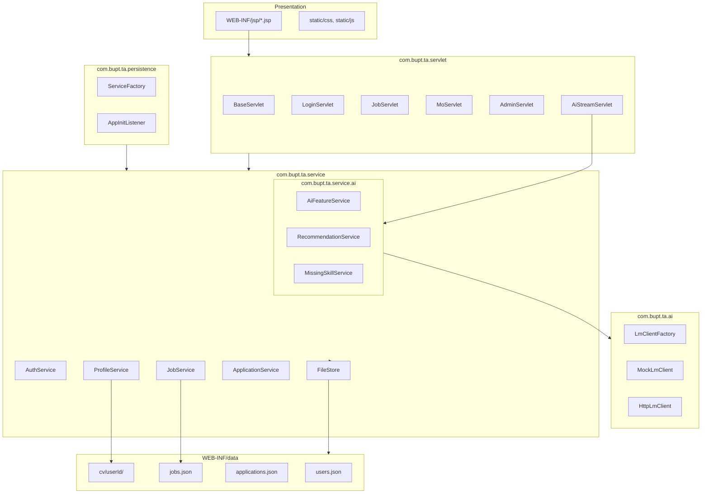
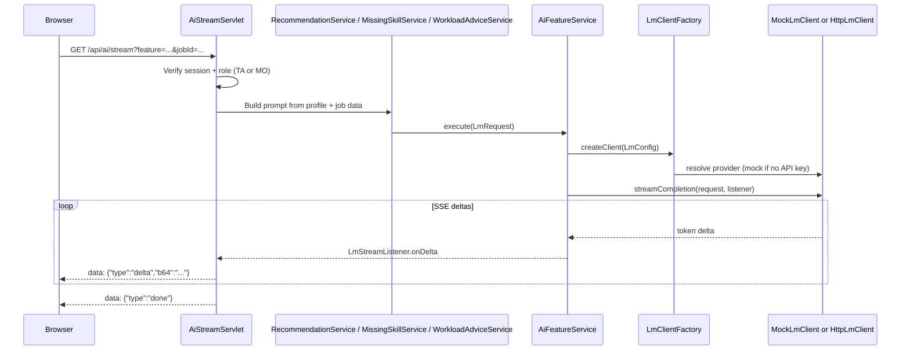

# System Design

**Project:** TA Recruitment System v1.0.0  
**Architecture style:** Layered monolith (Servlet + JSP + Service + FileStore)

---

## 1. Overview

The application is a Java WAR deployed on Tomcat. HTTP requests flow through servlets, which delegate to services that read and write **JSON text files** under `WEB-INF/data/`. CV files remain on the filesystem under `WEB-INF/data/cv/{userId}/`. No database is used (coursework compliance).

```
Browser (JSP views)
    ↓ HTTP
Servlet layer (com.bupt.ta.servlet)
    ↓
Service layer (com.bupt.ta.service, com.bupt.ta.service.ai)
    ↓
FileStore / JobService JSON I/O
    ↓
WEB-INF/data/*.json (+ CV filesystem)
```

Cross-cutting: `AppConfig` (configuration), `PasswordHasher` (BCrypt), `AuditService`, `NotificationService` (SMTP), AI layer (`com.bupt.ta.ai`).

---

## 2. Package structure



| Package | Responsibility |
|---------|----------------|
| `servlet` | HTTP routing, session auth, request validation, JSP forwarding |
| `service` | Business rules, orchestration, JSON file persistence |
| `persistence` | `ServiceFactory` wiring, startup listener |
| `model` | Domain POJOs (`User`, `Job`, `Application`, …) |
| `ai` | LM client abstraction (mock + HTTP) |
| `security` | Password hashing, CSRF filter |
| `util` | Config resolution, validation helpers |

Startup sequence: `AppInitListener` → `ServiceFactory.fromServletContext` → services stored in `ServletContext`.

---

## 3. Data model (JSON files)

```mermaid
erDiagram
    users ||--o| profiles : "user_id PK/FK"
    users ||--o{ applications : "user_id"
    users ||--o{ favorites : "user_id"
    users ||--o{ recently_viewed : "user_id"
    users ||--o{ password_reset_tokens : "user_id"
    users ||--o{ audit_logs : "actor_id optional"
    jobs ||--o{ favorites : "job_id"
    jobs ||--o{ recently_viewed : "job_id"
    jobs }o--|| users : "created_by_mo_id"

    users {
        varchar id PK
        varchar name
        varchar student_id
        varchar email UK
        varchar password_hash
        varchar role
        boolean active
    }

    profiles {
        varchar user_id PK_FK
        varchar full_name
        varchar student_id
        varchar id_card
        text skills
        varchar cv_file_name
        text education_json
    }

    jobs {
        varchar id PK
        varchar module_name
        varchar module_code
        text required_skills
        varchar status
        varchar created_by_mo_id FK
        varchar application_deadline
    }

    applications {
        varchar id PK
        varchar user_id FK
        varchar module_code
        varchar status
        text feedback
    }

    favorites {
        varchar user_id PK_FK
        varchar job_id PK_FK
    }

    recently_viewed {
        varchar user_id PK_FK
        varchar job_id PK_FK
        varchar viewed_at PK
    }

    audit_logs {
        varchar id PK
        varchar actor_id
        varchar action
        varchar target_type
        varchar created_at
    }

    password_reset_tokens {
        varchar token PK
        varchar user_id FK
        varchar expires_at
    }
```

Indexes: `applications(user_id)`, `applications(status)`, `jobs(status)`, `audit_logs(created_at)`.

---

## 4. AI feature flow (SSE)

TA and MO AI features stream via Server-Sent Events at `/api/ai/stream`. Servlets do not call the LM client directly; feature services build prompts, `AiFeatureService` invokes `LmClient`.



| Feature param | Role | Service |
|---------------|------|---------|
| `recommendation` | TA | `RecommendationService` |
| `missingSkills` | TA | `MissingSkillService` |
| `skillMatch` | TA | `SkillMatchService` |
| `moWorkloadAdvice` | MO | `WorkloadAdviceService` |

Default provider: **mock** (offline, deterministic). HTTP provider activates when `LM_BASE_URL` and `LM_API_KEY` are set.

---

## 5. Key design decisions

| Decision | Rationale |
|----------|-----------|
| Servlet/JSP over SPA | Course stack requirement; simple deployment |
| Repository pattern | Testability; isolates SQL from business logic |
| Flyway migrations | Repeatable schema + seed for dev/demo |
| CV on filesystem | Large binaries outside DB; path in `profiles.cv_file_name` |
| Pluggable LM client | Demo without API keys; swap vendor in one class |
| `ServiceFactory` | Single composition root for servlet `init()` |

---

## 6. Related documents

- [REQUIREMENTS.md](REQUIREMENTS.md) — functional and NFR summary
- [DEPLOYMENT.md](DEPLOYMENT.md) — runtime topology
- [TEST_PLAN.md](TEST_PLAN.md) — verification strategy
